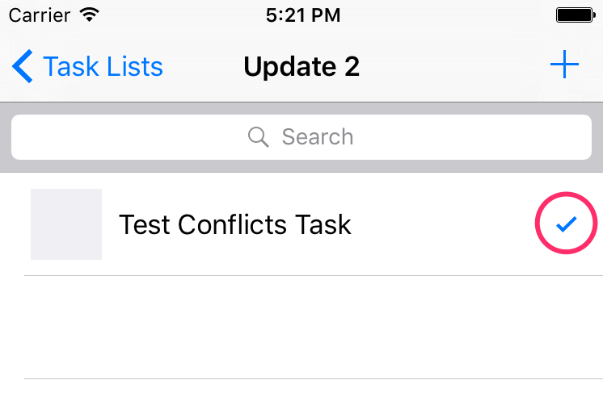

# Adding Synchronization

Now that you have all the data saved locally, you might want to save that data to the cloud to have it accessible on other devices or you might want to share it with other users. To do this, we’re going to add Sync Gateway to our app’s back end. It will run on your machine locally for development purposes.

You can [read more about Sync Gateway](http://developer.couchbase.com/documentation/mobile/1.2/get-started/sync-gateway-overview/index.html) functionality and features in our documentation. There’s a lot you can do with it!

Start this lesson by downloading the starter project below.

<div class="buttons-unit downloads">
  <a href="http://cl.ly/0h330W3h1k2Y/part2_start.zip" class="button">
    Download starter project
  </a>
</div>

[Download Couchbase Lite for iOS](http://www.couchbase.com/nosql-databases/downloads#couchbase-mobile). Unzip the file and drag **CouchbaseLite.framework** to the **Frameworks** folder in Finder.

## Installation

Now that your application runs smoothly on the device you are ready to introduce Sync Gateway.

1. [Download Sync Gateway](http://www.couchbase.com/nosql-databases/downloads#couchbase-mobile)
2. Unzip the file and locate the executable at couchbase-sync-gateway/bin/sync_gateway
3. Copy the executable file to the root of your project directory (in the same location as sync-gateway-config.json)

Before you start Sync Gateway, open sync-gateway-config.json. It declares a database called **todo** for which the **server** is **walrus**. In a production deployment, Sync Gateway persists its data to Couchbase Server and the **bucket** and **server** properties in the configuration file are used to specify which instance and bucket to store the data into. During development, you can set the **server** property to **walrus** (also known as the Walrus mode) and it will keep the data in memory. The only two valid values for the **server** field are either a Couchbase Server endpoint or walrus. Note that anytime you restart Sync Gateway in walrus mode, the database will be empty.

As an exercise, we have left out an important field from the configuration file. By default, Sync Gateway returns a **401 Unauthorized** response to any HTTP request that isn’t authenticated. You will learn how to setup authentication in lesson 3 but for the purpose of this lesson, you will focus exclusively on synchronization and conflict resolution. To override the behaviour, you must register the **GUEST** keyword which represents all the unauthenticated clients that will be synchronizing with your Sync Gateway instance. Replace the content of **sync-gateway-config.json** with the following.

```javascript
{
  "interface":":4984",
  "log": ["HTTP", "Auth"],
  "databases": {
    "todo": {
      "server": "walrus:",
      "users": {
  		"GUEST": {"disabled": false, "admin_channels": ["*"] }
	  }
    }
  }
}
```

Start Sync Gateway from the command-line in your project directory.

```bash
$ sync_gateway sync-gateway-config.json
```

Sync Gateway is listening on two ports:

- 4984 is the public port which will be used from the application.
- 4985 is the admin port used for administrative tasks (for security reasons, it’s only accessible on localhost).

With Sync Gateway up and running you can now add synchronization in the application code.

## Synchronization

Typically, an application needs to send data to the server and receive it. In Couchbase Mobile, this is handled by replications which run on the device. A replication requires a Couchbase Lite database and a Sync Gateway URL, and synchronizes data between the two. They can be of two types:

- Push: The data is pushed from Couchbase Lite to Sync Gateway.
- Pull: The data is pulled from Sync Gateway to Couchbase Lite.

There are a few terminologies that designate the role of each database involved in a replication:

- Source: The database where the data is read.
- Target: The database where the data is written.
- Local: The database that resides where the replication is running.
- Remote: The database to which the replication is sending data.

Open **AppDelegate.swift** and locate the **startReplication** method.
This method is called in **applicationDidFinishLaunchingWithOptions**.
Add the following below the **guard** statement.

```swift
pusher = database.createPushReplication(kSyncGatewayUrl)
pusher.continuous = true
NSNotificationCenter.defaultCenter().addObserver(self, selector: "replicationProgress:",
                                                 name: kCBLReplicationChangeNotification, object: pusher)
puller = database.createPullReplication(kSyncGatewayUrl)
puller.continuous = true
NSNotificationCenter.defaultCenter().addObserver(self, selector: "replicationProgress:",
                                                 name: kCBLReplicationChangeNotification, object: puller)
pusher.start()
puller.start()
```

Here you are starting a push and pull replication to have bi-directional sync with the remote Sync Gateway.
**kSyncGatewayUrl** is a constant in **AppDelegate.swift** and represents the URL to the Sync Gateway database (http://localhost:4984/todo/). If the application is running on a phone, you must replace **localhost** by the internal IP of the machine running Sync Gateway and ensure that the phone and laptop are connected to the same network. You can change this value to any valid URL pointing to a Sync Gateway database on the cloud, for example.

Build and run. Open [http://localhost:4985/_admin/db/todo](http://localhost:4985/_admin/db/todo) in the browser and notice all the documents are pushed to Sync Gateway!


## Managing Conflicts

Due to the unpredictability of mobile connections it's inevitable that more than one device will update the same document simultaneously. Couchbase Lite provides features to resolve these conflicts. The resolution rules are written by the developer to keep full control over which edit (also called a revision) should be picked.

Couchbase Lite uses revisions to resolve conflicts detected during replication. One significant difference from other databases is document versioning. Couchbase Lite uses a technique called Multi-version Concurrency Control (MVCC) to manage conflicts between multiple writers. Document versioning is similar to the check-and-set mechanism (CAS) of Couchbase Server, except that in Couchbase Lite versioning is required rather than optional and the token is a UUID rather than an integer.

Revisions form a tree data structure since they can have multiple branches. Here is an example of a revision tree which depicts the act of resolving a conflict by deleting one branch of the revision tree by adding a tombstone revision, and then adding a new rev to the winning branch.


The revision number follows a specific format.


A conflict usually occurs when two writers are offline and save a different revision of the same document. In this application, it could occur when:

- Two database instances update the name of an existing list.
- Two database instances update an existing task. One updates the task’s name while the other updates the **complete** property.

The following sections will teach you different ways to resolve conflicts.

To detect conflicts, you will use the **allDocs** query with a few options.

_
Open **AppDelegate.swift** and scroll to the **startConflictLiveQuery** method.
This method is called in **applicationDidFinishLaunchingWithOptions**.
Complete it with the following.

```swift
conflictsLiveQuery = database.createAllDocumentsQuery().asLiveQuery()
conflictsLiveQuery!.allDocsMode = .OnlyConflicts
conflictsLiveQuery!.addObserver(self, forKeyPath: "rows", options: .New, context: nil)
conflictsLiveQuery!.start()
```

The KVO handler is already present which calls the **resolveConflicts** method.

Here’s how you will resolve conflicts:

- **task-list** conflicts: keep the default; the winner picked by Couchbase Lite will remain the current revision. However, you need to clean up the extraneous revision.
- **task** conflicts: n-way merge; changes from all conflicting revisions are merged into a dictionary and saved to a new revision.

### Automatic

Even if the conflict isn’t resolved, Couchbase Lite has to return something. It chooses one of the two conflicting revisions as the "winner". The choice is deterministic, which means that every device that is faced with the same conflict will pick the same winner, without having to communicate.

It’s not all that easy to create conflicts in development because you would have to deploy the app to multiple devices or simulators and stop the replications to create the conflict. So before you begin resolving conflicts, you will add some code to easily create a conflict only for development purposes.

Open **TaskListsViewController.swift** and locate the **createListConflict** method.
This method is called in **viewDidLoad** but its body is empty at the moment.
Complete it with the following.

```swift
let savedRevision = createTaskList("Test Conflicts List")
let newRev1 = savedRevision?.createRevision()
let propsRev1 = newRev1?.properties
propsRev1?.setValue("Update 1", forKey: "name")
let newRev2 = savedRevision?.createRevision()
let propsRev2 = newRev2?.properties
propsRev2?.setValue("Update 2", forKey: "name")
do {
    try newRev1?.saveAllowingConflict()
    try newRev2?.saveAllowingConflict()
} catch let error as NSError {
    NSLog("Could not create document %@", error)
}
```

Here, you are using the **Revision** which is one layer below the **Document** API. The **Revision** has a method called **saveAllowingConflicts** which is helpful in this scenario.

Build and run.

At this point, there is a conflict on the lists page. The third list has two conflicting revisions, one where the **name** property is **Update 1** and on the other revision it’s **Update 2**.


Couchbase Lite picked **Update 2** as the winning revision (also called the **current** revision).

**NOTE:** To pick a winner, it compares the revision numbers and picks the higher one sorted lexicographically.

Delete that list and notice that **Update 1** is now displayed. Since you deleted the current revision and there is another revision on another branch of the tree, Couchbase Lite promotes the other one as the **current** revision.


 This can be surprising at first but it’s the strength of using a distributed database that defers the conflict resolution logic to the application. It’s your responsibility as the developer to ensure conflicts are resolved! Even if you decide to let Couchbase Lite pick the winner you must remove extraneous conflicting revisions to prevent the behaviour observed above.
 
 Open **AppDelegate.swift** and add the following in the **resolveConflicts** method.
 
```swift
let defaultWinning = revs[0]
let type = (defaultWinning["type"] as? String) ?? ""
switch type {
case "task-list":
 let props = defaultWinning.userProperties
 let image = defaultWinning.attachmentNamed("image")
 resolveConflicts(revisions: revs, withProps: props, andImage: image)
default:
 break
}
```

Build and run. 

Perform the same actions and this time deleting the list conflict doesn’t reveal the subsequent conflicting revision anymore.

### Three way merge

_
Similarly for tasks, open **TasksViewController.swift** and locate the **createTaskConflict** method.
This method is called in **viewDidLoad** but its body is empty at the moment.
Complete it with the following.

```swift
let savedRevision = createTask("Test Conflicts Task")
let newRev1 = savedRevision?.createRevision()
let propsRev1 = newRev1?.properties
propsRev1?.setValue("Update 1", forKey: "task")
let newRev2 = savedRevision?.createRevision()
let propsRev2 = newRev2?.properties
propsRev2?.setValue(true, forKey: "complete")
do {
    try newRev1?.saveAllowingConflict()
    try newRev2?.saveAllowingConflict()
} catch let error as NSError {
    NSLog("Could not save revisions %@", error)
}
```

Here, one revision changes the **task** property to **Update 1** and the other sets **complete** to **true**.

Build and run. 

Open a new list and notice that the revision changing the **task** property is the winner.


Delete the task. The revision that set the **complete** property to **true** becomes the **current revision**.



Open **AppDelegate.swift** and complete the **resolveConflicts** method with the following.

```swift
let defaultWinning = revs[0]
let type = (defaultWinning["type"] as? String) ?? ""
switch type {
case "task-list":
    let props = defaultWinning.userProperties
    let image = defaultWinning.attachmentNamed("image")
    resolveConflicts(revisions: revs, withProps: props, andImage: image)
case "task":
    let merged = nWayMergeConflicts(revs)
    resolveConflicts(revisions: revs, withProps: merged.props, andImage: merged.image)
default:
    break
}
```

Build and run. 

Open any list and this time the task has both changes (the text is updated and marked as completed).


Well done! You’ve built an application that works fully offline and  enables synchronization with the server when the network is available. Like in any distributed system, you also learned to detect and resolve conflicts.

Get the full source code for this project as a downloadable zip below. Feel free to share your feedback and findings, or ask any questions in the forums.

<div class="buttons-unit downloads">
  <a href="http://cl.ly/2E0F2l1u1v0v/part2_final.zip" class="button">
    Download final project
  </a>
</div>