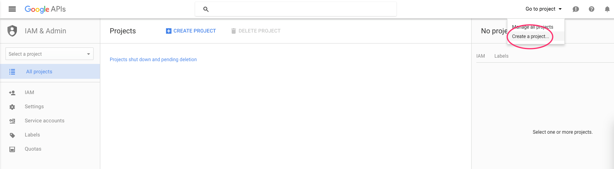
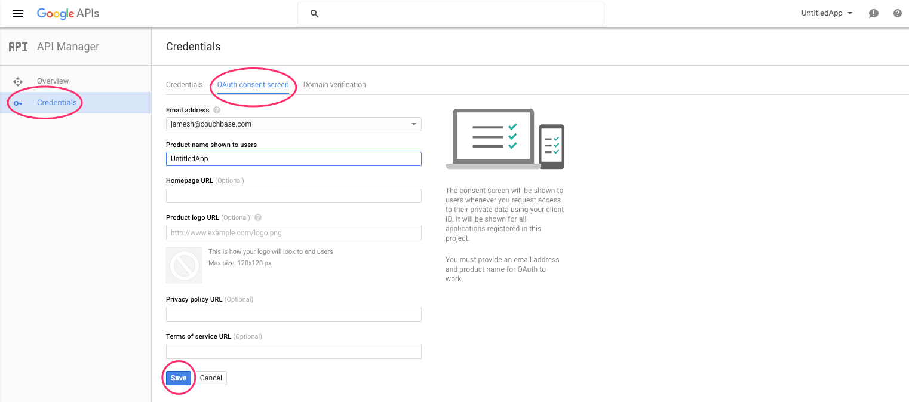
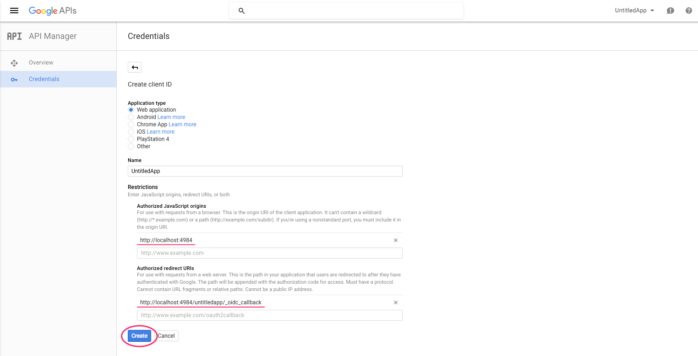
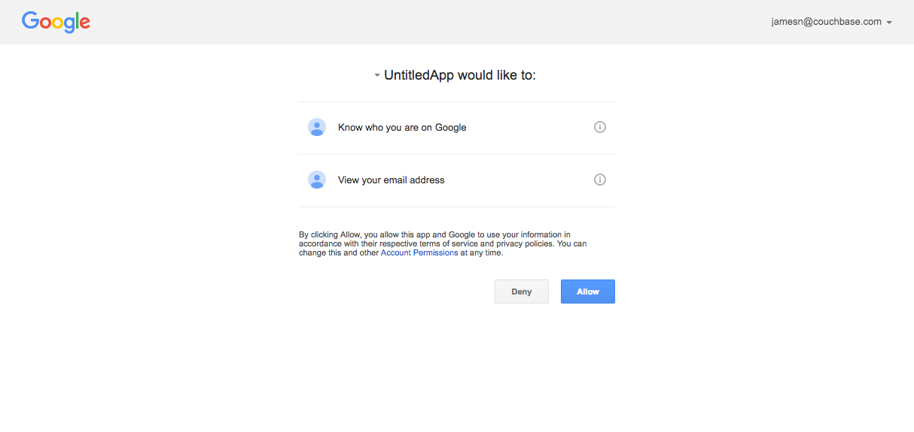
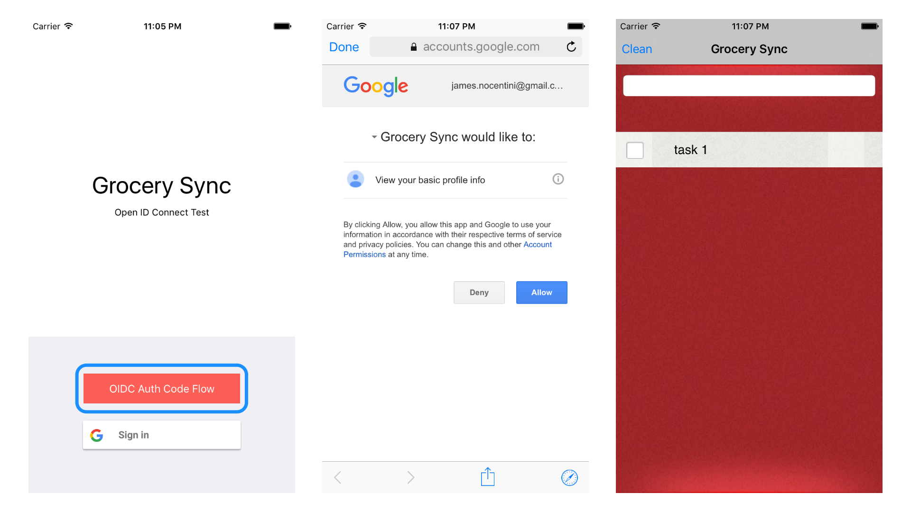

In this guide, we will use Google as an example for the OpenID Provider (abbreviated OP) but similar steps apply for any other OP that you intend to use.

## Creating a Google project

Follow the instructions below to create a new project in the Google API manager:

1. Go to the [API Manager](https://console.developers.google.com/iam-admin/projects).
2. Select the **Create a project...** menu.
	
3. Provide a name for your project.
4. Enable the **OAuth consent screen**.
	
5. Create a new **OAuth client ID** from the **Credentials** menu.
	
6. On the next page, select **Web application** to enable the authorization code flow.  Select **iOS** or **Android** to enable the implicit flow (Google Sign-In) and specify the origin and callback URLs for your Sync Gateway: 
  - `http://localhost:4984` is the origin of your Sync Gateway instance.
  - `http://localhost:4984/dbname/_oidc_callback` is the callback URL endpoint for your database.
	
7. Click **Create** and note the generated client id and client secret - they need to be included in your Sync Gateway config.

## Auth Code Flow

With the Google API project you created in the previous section you can now configure Sync Gateway. Create a new file `sync-gateway-config.json` with the following:

```javascript
{
  "log":["*"],
  "databases": {
    "untitledapp": {
      "server": "walrus:",
      "oidc": {
        "providers": {
          "GoogleAuthFlow": {
            "issuer": "https://accounts.google.com",
            "client_id": "912925907766-t25....",
            "validation_key": "your_client_secret",
            "callback_url": "http://localhost:4984/untitledapp/_oidc_callback",
            "register": true
          }
        }
      }
    }
  }
}
```

[Download Sync Gateway](http://www.couchbase.com/nosql-databases/downloads#couchbase-mobile) and start it from the command line with this configuration file:

```bash
~/Downloads/couchbase-sync-gateway/bin/sync_gateway sync-gateway-config.json
```

To test that everything is setup correctly open a web browser at [http://localhost:4984/untitledapp/_oidc](http://localhost:4984/untitledapp/_oidc). You are then redirect to login and to the consent screen.



The browser is then redirected to [http://localhost:4984/untitledapp/_oidc_callback](http://localhost:4984/untitledapp/_oidc_callback) with additional parameters in the querystring, and Sync Gateway returns the response:

```javascript
{
	"id_token":"eyJhbG....Rjq1DFipw",
	"session_id":"c518975db2ad094548188a232a875ea547bce966",
	"name":"accounts.google.com_108110999398334894801"
}
```

You can then verify the validity of the `session_id` by setting it in the request header. Using curl, that would be the following.

```bash
curl -vX GET -H 'Content-Type: application/json' \
             --cookie 'SyncGatewaySession=c518975db2ad094548188a232a875ea547bce966' \
             'http://localhost:4984/untitledapp/'
```

## Grocery Sync

The [openid branch of Grocery Sync iOS](https://github.com/couchbaselabs/Grocery-Sync-iOS/tree/openid) is a working sample that demonstrates how to use OpenID Connect with the Couchbase Lite iOS SDK and Sync Gateway.

1. Clone the repository: `git clone https://github.com/couchbaselabs/Grocery-Sync-iOS.git`
2. Checkout on the `openid` branch `git checkout origin/openid`
3. Download the latest developer preview of Sync Gateway
4. Start Sync Gateway with the config file in this repository: `~/path/to/sync_gateway sync_gateway_config.json`

You can login with your Google+ using the Auth Code Flow or Implicit Flow.

