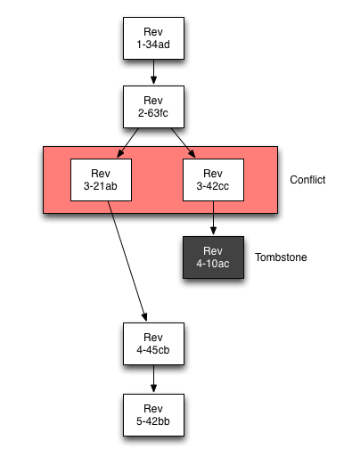

Couchbase Lite uses revisions to resolve conflicts detected during replication. One significant difference from other databases is document versioning. Couchbase Lite uses a technique called Multiversion Concurrency Control (MVCC) to manage conflicts between multiple writers. This is the same technique used by version-control systems like Git or Subversion, and by WebDAV. Document versioning is similar to the check-and-set mechanism (CAS) of Couchbase Server, except that in Couchbase Lite versioning is required rather than optional and the token is a UUID rather than an integer.

Every document has a special field called _rev that contains the revision ID. The revision ID is assigned automatically each time the document is saved. Every time a document is updated, it gets a different and unique revision ID.

When you save an update to an existing document, you must include its current revision ID. If the revision ID you provide isn’t the current one, the update is rejected. When this happens, it means some other endpoint snuck in and updated the document before you. You need to fetch the new version, reconcile any changes, incorporate the newer revision ID, and try again.

Keep in mind that Couchbase Lite is not a version control system and you must not use the versioning feature in your application (for example, you can’t use it to store the revision history of pages in a wiki). The old revisions are just cached—they are periodically thrown away when the database is compacted, and they’re never replicated. They’re not there to use in your data model, they’re there only to help with concurrency and resolving conflicts during replication.

## Revision History

### Revision Tree

Revisions form a tree data structure since they can have multiple branches.

Here is an example of a revision tree which depicts the act of resolving a conflict by deleting one branch of the revision tree by adding a tombstone revision, and then adding a new rev to the winning branch.

### Tombstoning

The reason that tombstone revisions exist is so that deletes can be sync'd to other databases. If revisions were simply deleted with a naive approach, then there would be no easy way to sync up with other databases that contained the revision.

There is a special field in a revision's JSON called _deleted which determines whether the revision is a tombstone revision or not. A consequence of this fact is that tombstone revisions can hold arbitrary amounts of metadata, which can be useful for an application. If the full metadata of the document is preserved in the tombstone revision, then a document could easily be restored to it's last known good state after it's been deleted at some point.

For examples of deleting revisions via adding a tombstone revision, refer to the guide on Documents.

## Saved vs Unsaved Revision

Here are the main differences between Saved and Unsaved Revision objects:

- Unsaved revisions have not yet been persisted to the database.
- Saved revisions have already been persisted to the database.
- Unsaved revisions are useful for adding attachments.

Unsaved Revisions are mainly useful for manipulating attachments, since they provide the only means to do so via the API. See Attachments for examples of adding/removing attachments.