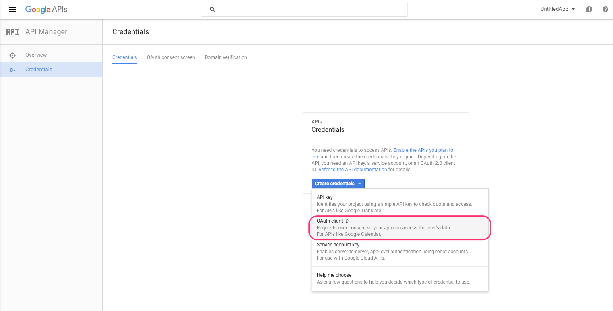

With OpenID Connect now integrated in Couchbase Mobile, you can authenticate users with providers that implement OpenID Connect. This means you won't need to setup an App Server to authenticate users with Google+, PayPal, Yahoo, Active Directory, etc. It works out of the box.

Open ID Connect can be configured in two different ways.

- Authorization Code Flow: With this method, you simply set an `OpenIDConnectAuthenticator` authorizer on the replication object. This is the preferred flow for mobile applications, as it supports retrieval and secure storage of the refresh token. This allows clients to avoid forcing users to re-enter username/password information every time their current session expires. Authorization Code Flow is supported in the iOS, Android and .NET Couchbase Lite SDKs.
- Implicit Flow: With this method, the retrieval of the ID token takes place on the device. You can then create a user session using the POST `/{db}/_session` endpoint on the Public REST API with the ID token.

When developing with the iOS, Android or .NET Couchbase Lite SDKs, you can take advantage of auth code flow which will handle all the complexity of user authentication for you. And the implicit flow should be used for all other platforms to provide the same user authentication capability. For example in web applications that use PouchDB or interact with Sync Gateway's REST API directly.

The [openid branch of Grocery Sync iOS](https://github.com/couchbaselabs/Grocery-Sync-iOS/tree/openid) is a working sample that demonstrates how to use OpenID Connect with the Couchbase Lite iOS SDK and Sync Gateway.

1. Clone the repository: `git clone https://github.com/couchbaselabs/Grocery-Sync-iOS.git`
2. Checkout on the `openid` branch `git checkout origin/openid`
3. Download the latest developer preview of Sync Gateway
4. Start Sync Gateway with the config file in this repository: `~/path/to/sync_gateway sync_gateway_config.json`

You can login with your Google+ using the Auth Code Flow or Implicit Flow.

In this guide, we will use Google as an example for the OpenID Provider (abbreviated OP) but similar steps apply for any other OP that you intend to use.

## How-To: Google+

### Creating a Google project

Follow the instructions below to create a new project in the Google API manager:

1. Go to the [API Manager](https://console.developers.google.com/iam-admin/projects).
2. Select the **Create a project...** menu.
	
3. Provide a name for your project.
4. Enable the **OAuth consent screen**.
	
5. Create a new **OAuth client ID** from the **Credentials** menu.
	
6. On the next page, select **Web application** to enable the authorization code flow.  Select **iOS** or **Android** to enable the implicit flow (Google Sign-In) and specify the origin and callback URLs for your Sync Gateway: 
  - `http://localhost:4984` is the origin of your Sync Gateway instance.
  - `http://localhost:4984/dbname/_oidc_callback` is the callback URL endpoint for your database.
	
7. Click **Create** and note the generated client id and client secret - they need to be included in your Sync Gateway config.
