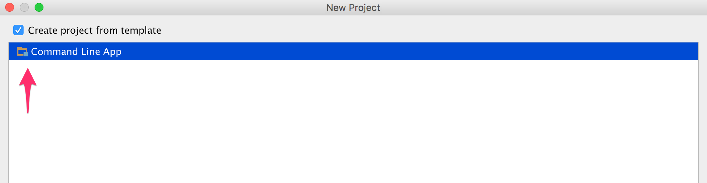
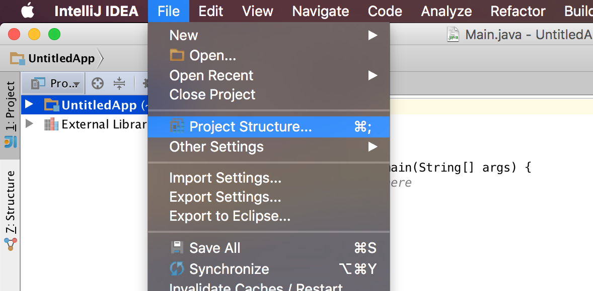
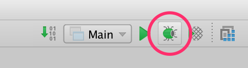

## Requirements

- JDK 1.7+

If you don't have IntelliJ IDEA already installed you can download the community edition from [here](https://www.jetbrains.com/idea/download/)

Open IntelliJ IDEA and choose the Create New Project menu. On the left pane, select the Java application template and set the Project SDK to 1.8.


Then click Next. Choose Command Line App for the project template.



Click Next. Fill in the Project name, Project location and Base package.


Click Finish. A new project window will open in IntelliJ.

## Couchbase Lite JAR files

Follow the steps below to add Couchbase Lite as a dependency to your project:

1. Download the Couchbase Lite Java SDK from [here](http://www.couchbase.com/nosql-databases/downloads#couchbase-mobile).
2. Open the File/Project Structure menu.
	
3. A new window will open. Select the Modules tab and add a new Library from Java.
	
4. Select the directory where you downloaded the Couchbase Lite Java SDK, then click OK.
	

Run the application in Debug mode. The console window will open.



In the next section you will add some code to create a document and save it to the database.

## Getting Started

Open **src/com.couchbase/Main.java** in IntelliJ and add the following in the main method.

```java
// Enable logging
Logger log = Logger.getLogger("app");
log.setLevel(Level.ALL);
JavaContext context = new JavaContext();
// Create a manager
Manager manager = null;
try {
    manager = new Manager(context, Manager.DEFAULT_OPTIONS);
} catch (IOException e) {
    e.printStackTrace();
}
// Create or open the database named app
Database database = null;
try {
    database = manager.getDatabase("app");
} catch (CouchbaseLiteException e) {
    e.printStackTrace();
}
// The properties that will be saved on the document
Map<String, Object> properties = new HashMap<String, Object>();
properties.put("title", "Couchbase Mobile");
properties.put("sdk", "Java");
// Create a new document
Document document = database.createDocument();
// Save the document to the database
try {
    document.putProperties(properties);
} catch (CouchbaseLiteException e) {
    e.printStackTrace();
}
// Log the document ID (generated by the database)
// and properties
log.info(String.format("Document ID :: %s", document.getId()));
log.info(String.format("Learning %s with %s", (String) document.getProperty("title"), (String) document.getProperty("sdk")));
```

Click the Debug button. Notice the document ID and properties are logged to the console.

