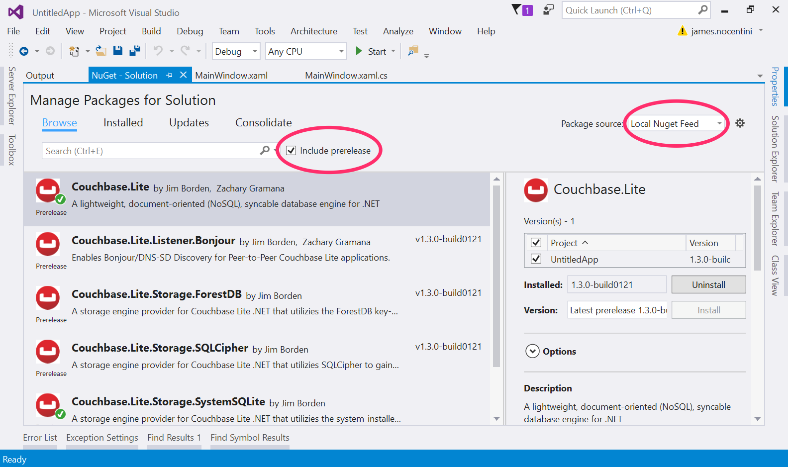

## NuGet

1. In **Solution Explorer**, right-click on your project and click **Select NuGet Packages...**.
    
2. Search for 'Couchbase Lite' and select the latest version of Couchbase Lite.
    

Once the Couchbase Lite NuGet package is installed you should see that Couchbase.Lite.Storage.SystemSQLite is also installed. That's because SQLite is the default storage type used by Couchbase Lite. You can install additional components as required by the application.

That's it! You can now start using Couchbase Lite in your application.

**Note**: UWP & Windows Phone isn't supported at this time.

## Getting Started

Open `MainWindow.xaml.cs` in Visual Studio and add the following in the `MainWindow` method.

```csharp
Manager manager = Manager.SharedInstance;

Database database = manager.GetDatabase("app");

Dictionary<string, object> properties = new Dictionary<string, object>
{
		{ "title", "Couchbase Mobile"},
		{ "sdk", "C#" }
};

Document document = database.CreateDocument();

document.PutProperties(properties);

Console.WriteLine($"Document ID :: {document.Id}");
Console.WriteLine($"Learning {document.GetProperty("title")} with {document.GetProperty("sdk")}");
```

Click the **Start** button. Notice the document ID and properties are logged to the Application Output.

## Using a build from the CI Server

This section describes how to use a build of Couchbase Lite .NET from the CI server. This is usually recommended if you are testing a fix you reported on the issue tracker.

1. Select a build from the CI server directory [http://latestbuilds.hq.couchbase.com/couchbase-lite-net/](http://latestbuilds.hq.couchbase.com/couchbase-lite-net/).
2. Download all the `.nupkg` files to a folder on your machine.
3. Create a Nuget local feed [https://docs.nuget.org/create/hosting-your-own-nuget-feeds#creating-local-feeds](https://docs.nuget.org/create/hosting-your-own-nuget-feeds#creating-local-feeds).
4. Select the local feed in the Nuget package manager inside Visual Studio to install the components.
    
