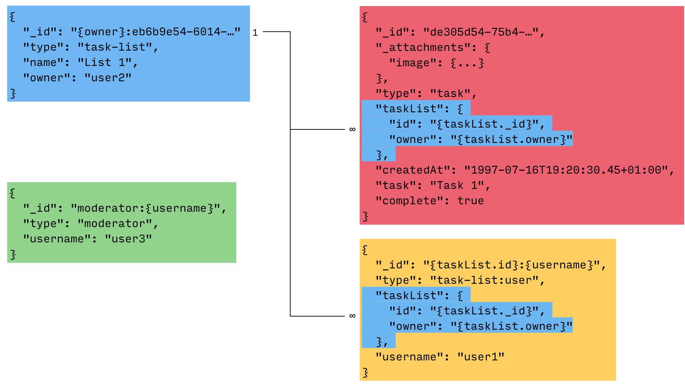

Couchbase Mobile is a schemaless database which means there are no restrictions on the database schema. It brings great flexibility during development because it removes the need to run database migrations every time the schema changes. Nonetheless, the application logic will expect particular data structures to be displayed on the screen. Below is the data model for this application. A starting point for data modeling in Couchbase Lite is to look at normalizing data, this is the process of splitting information into smaller documents.

- `task-list`: A document that represents a list
- `moderator`: A document that grants the moderator role to a particular user
- `task`: A document that represents a task
- `task-list:user`: A document that represents a user in a list

## Entity relationships

Once you have listed the different document types that will be used you can start thinking about the relationship between each one.

